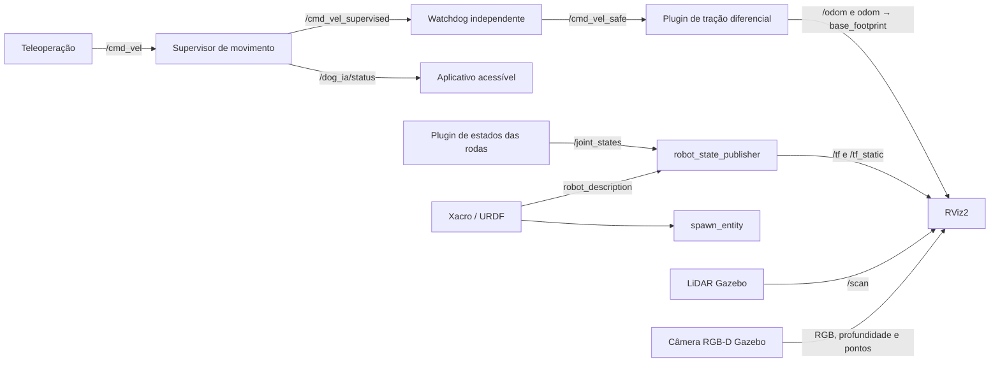
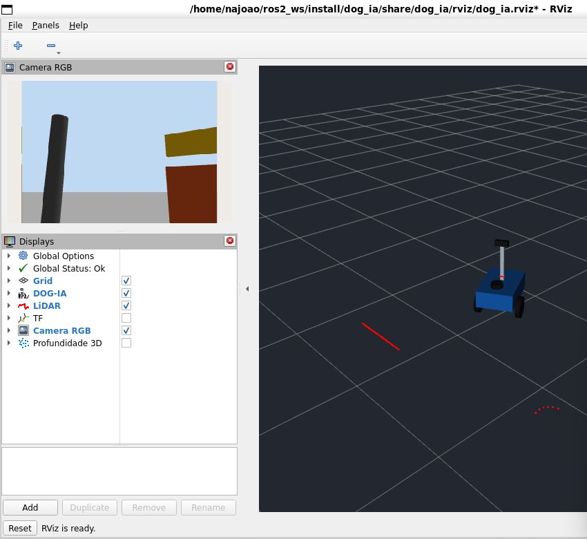

# DOG-IA: primeira versão do robô simulado

## Como abrir

Em um terminal Ubuntu, com nenhuma outra instância do Gazebo aberta:

```bash
source /opt/ros/humble/setup.bash
cd ~/ros2_ws
colcon build --packages-select dog_ia
source install/setup.bash
ros2 launch dog_ia simulacao.launch.py
```

O comando abre Gazebo Classic, cria o robô no cenário de teste, abre RViz2
e inicia o aplicativo em http://localhost:8765.
Consulte [produto assistivo e limites](produto_assistivo.md).
Para encerrar, use Ctrl+C no terminal que iniciou a simulação.
Para executar sem as janelas: acrescente `gui:=false rviz:=false`.
A câmera de profundidade ainda exige um ambiente gráfico disponível.

## Movimentar pelo teclado

Abra outro terminal Ubuntu:

```bash
source /opt/ros/humble/setup.bash
source ~/ros2_ws/install/setup.bash
ros2 run dog_ia teclado
```

Mantenha o foco nesse terminal. Teclas: `i` avança, `,` recua, `j` gira à
esquerda, `l` gira à direita e `k` para. Ctrl+C encerra a teleoperação.
O teclado próprio envia comandos continuamente e para após 0,5 segundo sem
novas teclas. O supervisor também bloqueia comandos vencidos e obstáculos próximos.

## Modelo físico

- Chassi de 0,50 x 0,34 x 0,16 m, com massa de 8 kg.
- Duas rodas de raio 0,10 m; separação entre centros de 0,39 m.
- Apoio traseiro: esfera de baixo atrito, aproximando uma roda boba esférica.
- LiDAR 2D a aproximadamente 0,34 m do chão, 360 amostras e 10 Hz.
- Câmera RGB-D a aproximadamente 0,675 m do chão, inclinada 11,5 graus
  para cima, resolução 320 x 240 e 10 Hz.
- Massas, inércias e colisões principais definidos; controle diferencial no Gazebo.
- O suporte da câmera é visual, sem colisão nesta simulação simplificada,
  para não ocluir o LiDAR; essa simplificação requer revisão no hardware.

O campo de visão foi escolhido para os primeiros testes. A posição da câmera
precisa ser reavaliada ao implementar buracos e proteção da altura do usuário.

## Arquivos

- `dog_ia/urdf/dog_ia.urdf.xacro`: modelo e plugins.
- `dog_ia/worlds/teste.world`: piso, caixa, poste e placa suspensa.
- `dog_ia/launch/simulacao.launch.py`: inicialização integrada.
- `dog_ia/rviz/dog_ia.rviz`: modelo, laser, imagem RGB e nuvem de pontos opcional.
- `dog_ia/scripts/validar_simulacao.py`: teste de integração com movimento.

O mundo usa geometria local, sem depender de download de modelos.
A placa suspensa é um objeto estático de teste, sem suporte modelado.

## Tópicos

| Tópico | Tipo | Uso |
|---|---|---|
| `/cmd_vel` | geometry_msgs/Twist | Comando solicitado, entrada do supervisor |
| `/cmd_vel_supervised` | geometry_msgs/Twist | Comando do supervisor para o watchdog |
| `/cmd_vel_safe` | geometry_msgs/Twist | Saída do watchdog, entrada do motor |
| `/dog_ia/status` | std_msgs/String | Estado do supervisor em JSON |
| `/odom` | nav_msgs/Odometry | Odometria das rodas |
| `/joint_states` | sensor_msgs/JointState | Posição das rodas |
| `/scan` | sensor_msgs/LaserScan | LiDAR |
| `/camera/image_raw` | sensor_msgs/Image | Imagem RGB |
| `/camera/camera_info` | sensor_msgs/CameraInfo | Calibração RGB |
| `/camera/depth/image_raw` | sensor_msgs/Image | Profundidade em metros, 32FC1 |
| `/camera/depth/camera_info` | sensor_msgs/CameraInfo | Calibração de profundidade |
| `/camera/points` | sensor_msgs/PointCloud2 | Nuvem de pontos |
| `/tf`, `/tf_static` | tf2_msgs/TFMessage | Transformações |
| `/clock` | rosgraph_msgs/Clock | Tempo simulado |
| `/gazebo/model_states` | gazebo_msgs/ModelStates | Posição real no simulador para testes |

O estado real do Gazebo serve apenas para validar resultados, não como
substituto dos sensores em algoritmos futuros de navegação/percepção.

## Arquitetura inicial



```text
odom
└── base_footprint
    └── base_link
        ├── left_wheel_link
        ├── right_wheel_link
        ├── caster_link
        ├── lidar_link
        └── mast_link
            └── camera_link
                └── camera_optical_frame
```

O plugin de tração publica `odom → base_footprint`; robot_state_publisher
publica as demais transformações. Não há publicadores duplicados para as rodas.
O frame `map` será adicionado na etapa de SLAM/localização.

## Validação realizada em 06/10/2026

- Compilação do pacote aprovada.
- Expansão do Xacro e conversão URDF para SDF aprovadas.
- Robô criado no Gazebo; RViz2 com estado global OK e câmera exibindo imagem.
- Recebimento de laser, RGB, profundidade, pontos, odometria e estados das rodas.
- Transformações de `odom` para chassi, rodas, apoio e sensores disponíveis.
- Movimento real para frente: 0,435 m; odometria: 0,435 m.
- Giro real para a esquerda: 0,511 rad.
- Após velocidade zero, deslocamento residual: 0,0001 m.



Para repetir a validação, inicie uma simulação nova e, em outro terminal:

```bash
source /opt/ros/humble/setup.bash
source ~/ros2_ws/install/setup.bash
python3 ~/ros2_ws/src/DOG-IA-ROBO-CAO-GUIA/dog_ia/scripts/validar_simulacao.py
```

Esse teste move o robô: execute em uma instância nova do cenário de teste,
sem teleoperação simultânea. Os resultados medidos podem variar um pouco.

## Próximas funções

Ainda não implementados: SLAM, Nav2, desvio autônomo, reconhecimento de semáforo,
detecção de buracos/obstáculos suspensos e alertas de voz. Os sensores estão
disponíveis para desenvolver essas funções nas próximas etapas.

Referências dos plugins:
- https://github.com/ros-simulation/gazebo_ros_pkgs/blob/ros2/gazebo_plugins/include/gazebo_plugins/gazebo_ros_diff_drive.hpp
- https://github.com/ros-simulation/gazebo_ros_pkgs/blob/ros2/gazebo_plugins/include/gazebo_plugins/gazebo_ros_camera.hpp
- https://github.com/ros-simulation/gazebo_ros_pkgs/blob/ros2/gazebo_plugins/include/gazebo_plugins/gazebo_ros_ray_sensor.hpp
