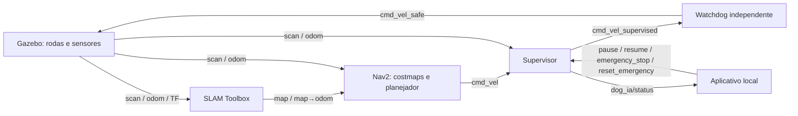

# Navegação conforme o guia da Aula 06

## Iniciar a demonstração

Feche o launch anterior antes de abrir este, evitando dois simuladores ou
supervisores concorrentes. No terminal Ubuntu:

```bash
source /opt/ros/humble/setup.bash
cd ~/ros2_ws
colcon build --packages-select dog_ia
source install/setup.bash
ros2 launch dog_ia urbano.launch.py
```

O launch abre Gazebo, modelo/sensores, supervisor, watchdog, aplicativo,
SLAM Toolbox, Nav2 e RViz2 com mapa e rota. O cenário delimitado é um
laboratório de navegação, ainda não uma cidade com calçadas/faixas/semáforos.
Em RViz2, use **2D Goal Pose** para definir um destino no chão já mapeado.
Não use **2D Pose Estimate** neste modo: a localização vem do SLAM, sem AMCL.
Não envie teleoperação simultaneamente a uma missão Nav2.

`navegacao.launch.py` inicia somente SLAM/Nav2, para anexar a uma simulação
já aberta. Não inicie esse launch se `urbano.launch.py` já estiver rodando.

## Arquitetura inicial



TF: `map → odom → base_footprint → base_link → rodas / lidar_link / camera_link → camera_optical_frame`.
Ação principal: `/navigate_to_pose`, tipo `nav2_msgs/action/NavigateToPose`.
Sensores, percepção e áudio terão nós separados conforme o material teórico.
O nó de áudio Python e os detectores ainda não fazem parte desta arquitetura executada.

## Configuração

- Costmaps global/local com contorno real do chassi e rodas: 0,54 × 0,50 m,
  acrescido de 0,02 m de padding. Não representa ainda o espaço de uma pessoa.
- Inflação de 0,65 m como hipótese de teste, não distância validada para guiamento.
- Navegação limitada a 0,20 m/s e 0,50 rad/s, igual ao supervisor.
- Planejador não atravessa células desconhecidas.
- Smoother entrega `/cmd_vel`; somente o watchdog publica `/cmd_vel_safe`.
- Configuração baseada nos parâmetros instalados do Nav2 Humble (Apache-2.0).
- SLAM online com `/scan`, `base_link`, `odom`, `map` e relógio simulado.

## Validação em 06/10/2026

Teste automático contra Gazebo/Nav2 reais:

```bash
source /opt/ros/humble/setup.bash
source ~/ros2_ws/install/setup.bash
python3 ~/ros2_ws/src/DOG-IA-ROBO-CAO-GUIA/dog_ia/scripts/validar_navegacao.py
```

Resultado observado: ação SUCCEEDED, deslocamento no Gazebo de **1,298 m**,
erro de posição no mapa de **0,123 m**; mapa com **236 × 156 células**, das quais
33.278 conhecidas. Confirmado um único publicador no tópico do motor:
`actuator_watchdog`. Os 13 testes das regras do supervisor continuam passando.
Este teste valida um destino simples; não comprova cobertura de missões urbanas.

O RViz2 apresentou aviso de shader OpenGL na camada Map no WSLg. A publicação
do mapa, TF e execução da missão foram verificadas por dados ROS, mas a
renderização do mapa requer conferência gráfica adicional antes da apresentação.

## O que falta do guia

Cenário urbano com travessia, ensaios de navegação com obstáculos, detector
OpenCV/cv_bridge para sinal vermelho/verde ou faixa, bloqueio no vermelho,
detecção 3D de riscos, nó Python de voz, relatório e vídeo da missão final.
Mapa externo do Google/Waze e aplicativo comercial são extensões futuras;
não substituem o mapeamento e a navegação solicitados pelo professor.
