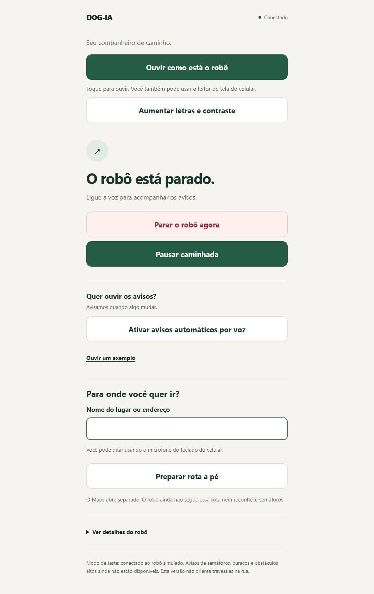

# DOG-IA: evolução para um aplicativo conectado ao robô

## Direção do produto

Aplicativo conectado ao DOG-IA para informar riscos e acompanhar o robô.
A escolha do usuário é aplicativo conectado ao robô, não percepção apenas
pela câmera do telefone. Versão atual: 0.1.0, protótipo em simulação.

O processamento de sensores deverá ocorrer no robô. O celular apresenta voz,
vibração, estado da conexão e comandos de pausa. Não deve ser necessário
transmitir vídeo a um serviço externo para emitir alertas básicos.

## O que está implementado

- Modelo com rodas, LiDAR, RGB-D, odometria e TF.
- Supervisor entre comandos de velocidade e motor simulado.
- Watchdog independente: envia zero se o supervisor deixa de atualizar por 0,25 segundo.
- Limites de 0,20 m/s e 0,50 rad/s nesta configuração de teste.
- Parada por comando sem atualização por 0,60 segundo.
- Parada por LiDAR sem atualização por 0,70 segundo ou odometria por 1 segundo.
- Verificação de timestamp do LiDAR e da odometria, além do recebimento local.
- Bloqueio de avanço/recuo/giro por obstáculos próximos no plano do laser.
- Bloqueio por cobertura insuficiente ou leitura inválida na direção usada.
- Pausa e emergência com estado retido. Retomar não limpa emergência.
- Liberar emergência deixa pausado; comandos anteriores são descartados.
- Teclado próprio com parada após 0,50 segundo sem novas teclas.
- Interface acessível local, conectada aos dados do ROS, com avisos por voz.
- Interface identifica falta de conexão e funções ainda indisponíveis.

Não estão implementados: percepção de semáforo, buracos, obstáculos suspensos,
planejamento de rota, ligação protegida com um celular físico e vibração nativa.
Os sensores publicam dados, mas isso não equivale a detectar esses riscos.

## Abrir a interface

```bash
source /opt/ros/humble/setup.bash
cd ~/ros2_ws
colcon build --packages-select dog_ia
source install/setup.bash
ros2 launch dog_ia simulacao.launch.py
```

No navegador do mesmo computador: http://localhost:8765.
No WSL2, o Windows pode acessar o serviço pelo encaminhamento de localhost.
O serviço escuta apenas em 127.0.0.1, sem exposição automática à rede.
Para não iniciar a interface: acrescente `app:=false` no launch.

Para movimentar:

```bash
source /opt/ros/humble/setup.bash
source ~/ros2_ws/install/setup.bash
ros2 run dog_ia teclado
```

Segure `i` para avançar, `,` para recuar, `j`/`l` para girar; `k` ou espaço
param. O teclado publica continuamente em `/cmd_vel`; o supervisor filtra e
publica em `/cmd_vel_supervised`; o watchdog independente verifica atualização
e publica em `/cmd_vel_safe`, a entrada do motor no launch oficial.

## Acessibilidade e comunicação

- Controles com altura mínima de 72 px, texto claro e foco visível.
- Primeiro botão permite ouvir o estado sem ativar todos os avisos.
- Letras ampliadas e contraste reforçado com preferência salva no navegador.
- Parada aparece antes de pausa/retomada; todos os controles funcionam por teclado.
- Layout responsivo e interface inteiramente em português.
- Estado explicado em texto; cores são auxiliares.
- Regiões de anúncio para leitores de tela e avisos urgentes separados.
- Voz ativada por escolha do usuário, evitando conflito com o leitor de tela.
- Anúncios de estado por mudança, sem repetir o mesmo aviso a cada atualização.
- Interface mostra dados desatualizados como indisponíveis.
- Teste em largura de 390 px sem rolagem horizontal.

As vozes do navegador podem depender do sistema e da rede. Ainda falta testar
com pessoas com deficiência visual, TalkBack/VoiceOver e aparelhos reais.
Botões grandes e marcação semântica não comprovam acessibilidade completa.

## Rota a pé e integração com mapas

Implementado: formulário de destino e link oficial para Google Maps em modo
`walking`. O destino só é enviado ao Google quando a pessoa abre o link.
A digitação pode usar a ditagem do teclado do telefone. Não há captura de
microfone no protótipo. Abrir o Maps não faz o robô seguir a rota.

Para seguir uma rota: serviço de rotas a pé → coordenadas e instruções →
localização do robô (GNSS/IMU e sensores locais) → referência de mapa local →
planejador Nav2 → supervisor existente → motores. GPS isolado não comprova
alinhamento com calçada/faixa; rota a pé não garante acessibilidade do percurso.
A ligação com o telefone precisa permanecer ativa quando o Maps está aberto.

Waze Deep Links abrem navegação externa, mas não fornecem a trajetória de volta
ao supervisor. Priorizar rotas de pedestres do Google para esta finalidade.
A API de rotas oferece instruções/geometria, não cor atual do sinal de pedestres.
Não inferir vermelho/verde a partir de trânsito, mapa ou tempo de viagem.

Prioridade definida pelo usuário: acessibilidade → rota → semáforo → buracos.
Próxima entrega de robótica: travessia simulada com sinal de pedestres,
identificação do sinal pertinente por câmera, parada antes da faixa e alertas.
Vermelho: bloquear aproximação à travessia e avisar. Leitura ausente, antiga,
ocluída ou ambígua: manter bloqueio e avisar que o sinal não foi identificado.
Verde reconhecido: informar estado observado, sem retomar nem autorizar travessia
automaticamente. Toda a área de travessia requer avaliação própria.

Referências oficiais consultadas em 06/10/2026:
- https://developers.google.com/maps/documentation/urls/get-started
- https://developers.google.com/maps/documentation/routes/reference/rest/v2/TopLevel/computeRoutes
- https://developers.google.com/waze/deeplinks

## Semáforos de pedestres

O detector precisa reconhecer o sinal de pedestres pertinente à travessia,
separando-o dos semáforos de veículos e de outras fontes de luz.
Começar com um cenário controlado, classificação por imagem e validação temporal.
Depois avaliar um detector treinado com dados variados, anotados e separados
por local/cena entre treino, validação e teste, evitando vazamento de dados.

Estados: vermelho, verde, desconhecido, ocluído e indisponível.
Frames antigos, baixa confiança e perda de câmera nunca viram verde por padrão.
Uma confirmação temporal não elimina erros de identificação do sinal relevante.

Exemplos de avisos:
- “Sinal de pedestres vermelho.”
- “Sinal de pedestres não identificado.”
- “Sinal de pedestres verde identificado.”

Identificar verde não comprova segurança de travessia: veículos, tempo restante,
trajeto e obstáculos precisam de avaliação própria. A interface não dirá
“pode atravessar” a partir da cor sozinha.

## Buracos, degraus e desníveis

Buraco é uma quebra no piso esperado; não é simplesmente ausência de pontos.
Usar profundidade, calibração, geometria do chão, persistência temporal e região
de passagem. Descartar leituras inválidas sem classificá-las como piso livre.

A câmera atual está orientada para cima; a solução de produto deve incluir
uma câmera/sensor dedicado ao chão ou reposicionamento validado de sensores.
A escolha não deve sacrificar a detecção de riscos na altura do usuário.

Classes iniciais: piso contínuo, degrau, possível buraco, chão não observável.
Saída inicial: alerta e parada; nenhuma promessa de contornar o risco sem teste.
Distâncias só serão anunciadas depois de calibradas e avaliadas.

## Obstáculos suspensos e espaço da pessoa

Usar nuvem de pontos transformada para uma referência consistente.
Definir um corredor de passagem considerando altura/largura da pessoa,
distância entre robô e usuário, curvas, margem lateral e campo de visão.
Um caminho livre para o chassi pode estar bloqueado para a pessoa.
O LiDAR 2D atual não protege a região acima do plano de varredura.

## Eventos para o futuro aplicativo móvel

Cada evento deve ter versão, identificador, tipo, origem, tempo de captura,
prazo de validade, severidade, disponibilidade e confiança quando calibrada.
Distância e direção são opcionais: informação desconhecida não recebe valor zero.
Exemplo de tipos: pedestrian_signal, ground_hazard, overhead_obstacle,
sensor_unavailable, connection_lost. Alertas vencidos são descartados.

A API atual `/api/status` é para o protótipo local, não um protocolo móvel pronto.
O vínculo celular/robô precisa de pareamento, autenticação, canal protegido,
limite de mensagens, confirmação das ações e estados em caso de desconexão.
Evitar ligar o servidor atual à rede apenas mudando para 0.0.0.0.

## Testes realizados

Em 06/10/2026:
- 13 testes automatizados de regras do supervisor aprovados.
- Teste físico no Gazebo com supervisor ativo: avanço de 0,429 m, odometria
  de 0,429 m, giro de 0,529 rad e deslocamento residual de 0,0001 m na parada.
- API: comando vencido causa velocidade zero.
- API: pausa bloqueia comandos; retomar descarta comando anterior.
- API: emergência permanece após retomar; liberar emergência mantém pausado.
- API: requisição de controle com origem externa rejeitada com HTTP 403.
- Processo dos sensores suspenso: estado sensor_lost e saída zero.
- Processo do supervisor suspenso: aplicativo marca conexão indisponível.
- Supervisor suspenso durante movimento: watchdog independente enviou zero;
  deslocamento residual na verificação de parada: 0,00002 m.
- Aproximação real da caixa: parada em x=1,158 m, antes de contato físico.
- Interface: botões de emergência, retomada e liberação exercitados no navegador.
- Layout em largura de celular inspecionado.

Para testes de regras:

```bash
cd ~/ros2_ws
source /opt/ros/humble/setup.bash
source install/setup.bash
python3 -m pytest src/DOG-IA-ROBO-CAO-GUIA/dog_ia/test/test_motion_guard.py -q
```

## Limites que precisam ser resolvidos antes de um robô físico

O supervisor é software de protótipo, não uma função de segurança certificada.
Se o supervisor parar, o watchdog independente envia zero. Se o próprio
watchdog ou todo o computador morrer, o plugin pode conservar o último comando.
A versão física precisa de watchdog no controlador dos motores,
parada física independente, limite de torque e ensaios de frenagem.

Os thresholds atuais são hipóteses de simulação, não distâncias validadas
para usuários reais. O monitor não substitui costmap nem planejador, e não
faz desvio automático. As regras geométricas usam o LiDAR do modelo atual.
Mudanças de montagem exigem revisão dos offsets e margens.

Na simulação simplificada, o suporte da câmera conserva visual e inércia,
mas não colisão, evitando auto-oclusão do ray sensor. Um robô físico exige
montagem sem oclusão relevante ou tratamento explícito de regiões não observadas.

ROS 2 local não impede outro nó de publicar diretamente no tópico do motor.
Pareamento/autorização e isolamento precisam ser tratados antes de produção.

## Interface do protótipo



## Próximas entregas, em ordem

1. Cenário urbano e testes de mapeamento/navegação, mantendo o supervisor.
2. Detector de semáforo de pedestres com estados desconhecido e indisponível.
3. Sensor de piso e detector de desníveis com referência geométrica.
4. Detecção de obstáculos na altura do usuário.
5. Aplicativo Android/iOS com pareamento protegido, voz e vibração nativas.
6. Validação com especialistas em orientação e mobilidade e usuários,
   inicialmente em ambiente controlado, com acompanhamento e parada física.

Registrar taxas de detecção, falsos negativos, falsos alertas, latência total,
disponibilidade por condição e distância física de parada. Separar resultados
de simulação, laboratório e rua; não extrapolar aprovação do Gazebo para uso real.

Referências:
- Android: https://developer.android.com/guide/topics/ui/accessibility/apps
- Nav2: https://docs.nav2.org/jazzy/tutorials/general_tutorials/using_collision_monitor/using_collision_monitor/
